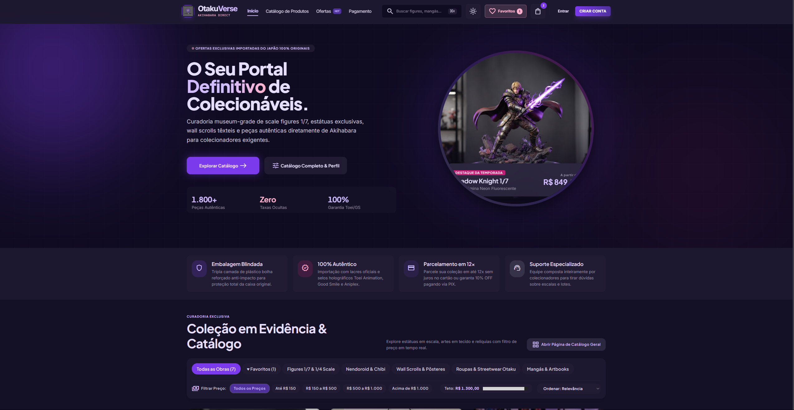
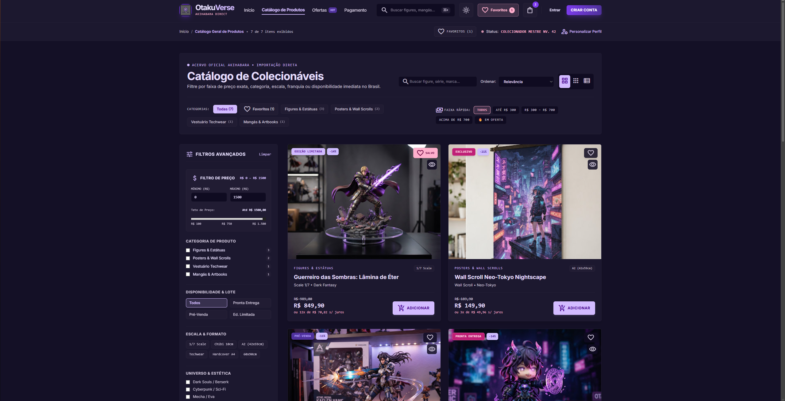
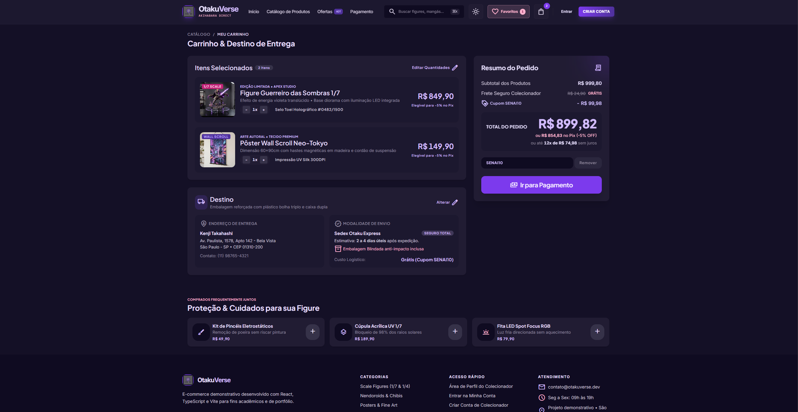
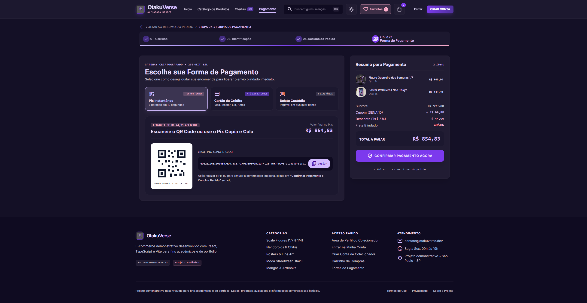

# 🎌 OtakuVerse

> E-commerce demonstrativo de colecionáveis desenvolvido com React, TypeScript e Vite para fins acadêmicos e de portfólio.

🔗 **[Acessar demonstração](https://otakuverse-ecommerce-pnu7.vercel.app/)**

---

## 📖 Sobre o projeto

O OtakuVerse é um projeto de e-commerce desenvolvido para demonstrar habilidades em desenvolvimento Front-End.

A aplicação simula uma experiência de compra de produtos relacionados a animes, mangás e colecionáveis, apresentando funcionalidades como catálogo de produtos, favoritos, carrinho, autenticação, perfil de usuário e fluxo de checkout.

> ⚠️ **Aviso:** este é um projeto demonstrativo. Produtos, usuários, pedidos, avaliações, preços e demais informações apresentadas são fictícios.

---

## ✨ Funcionalidades

- 🛍️ Catálogo de produtos
- 🔎 Busca e filtros
- ❤️ Favoritos
- 🛒 Carrinho de compras
- 👤 Cadastro e login
- 📋 Perfil do usuário
- 📦 Histórico de pedidos
- 💳 Fluxo de checkout e pagamento
- 🌙 Tema claro e escuro
- 💾 Persistência de dados com LocalStorage
- 📱 Interface responsiva

---

## 🛠️ Tecnologias

- React
- TypeScript
- Vite
- JavaScript
- CSS
- LocalStorage

---

## 🎯 Objetivo

O projeto foi desenvolvido para praticar e demonstrar conceitos de desenvolvimento Front-End, incluindo:

- Componentização com React
- Tipagem com TypeScript
- Organização de componentes e telas
- Gerenciamento de estado
- Persistência de dados no LocalStorage
- Criação de interfaces responsivas
- Desenvolvimento de fluxos de navegação
- Deploy de aplicações web

---

## 🚀 Como executar

### Pré-requisitos

- Node.js
- npm

### Instalação

```bash
git clone https://github.com/lucaszx1/otakuverse-ecommerce.git
cd otakuverse-ecommerce
npm install
```

### Executar o projeto

```bash
npm run dev
```

Depois, acesse o endereço exibido pelo Vite no terminal.

---

## 🌐 Demonstração

O projeto está disponível online através da Vercel:

**[OtakuVerse — Demo](https://otakuverse-ecommerce-pnu7.vercel.app/)**

---

## 📸 Screenshots

### Página inicial



### Catálogo



### Carrinho



### Checkout



---

## 📚 Contexto acadêmico

Projeto desenvolvido como parte da evolução prática em desenvolvimento Front-End, com foco em React, TypeScript e construção de interfaces web modernas.

---

## 👨‍💻 Autor

**Lucas Vinicius**

Front-End Developer  
🎓 Análise e Desenvolvimento de Sistemas

GitHub: [@lucaszx1](https://github.com/lucaszx1)

---

## ⚠️ Disclaimer

Este projeto possui finalidade exclusivamente acadêmica e demonstrativa.

Nenhuma venda, pagamento, entrega ou serviço comercial é realizado através desta aplicação. Todos os dados apresentados são fictícios.
